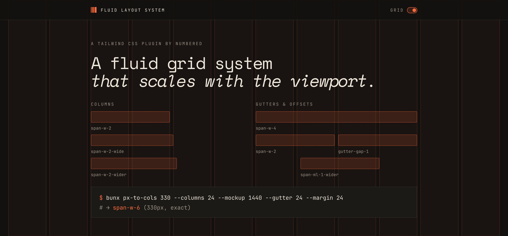

# Tailwind CSS Fluid Layout System



A [Tailwind CSS v4](https://tailwindcss.com/) plugin that turns your design grid into fluid utilities, plus a `px-to-cols` CLI to translate mockup pixels into grid classes. 👉 [Demo](https://fls.numbered.studio)

## Why not CSS subgrid?

Subgrid can pass the page grid down, but only if every wrapper in between is itself a subgrid. One flex row, block wrapper or positioned box breaks the chain, and each component has to opt in. These utilities resolve to viewport units rather than percentages of the parent, so `span-w-2` has the same width at any nesting depth, whatever the parents are.

## Setup

```bash
bun add -D @numbered/tailwind-fluid-layout-system
```

```css
/* app.css */
@import 'tailwindcss';
@config './tailwind.config.js';
```

```js
// tailwind.config.js
import fls from '@numbered/tailwind-fluid-layout-system'

export default {
  theme: {
    grid: {
      mobile:  { columns: 10, mockupWidth: 375,  gutter: 10, margin: 20 },
      desktop: { columns: 12, mockupWidth: 1440, gutter: 20, margin: 60, maxWidth: 1920, screen: 'lg' },
    },
  },
  plugins: [fls()],
}
```

```html
<article class="grid-container">
  <div class="span-w-4 lg:span-w-8 lg:span-ml-2-wide gutter-gap-0.5">…</div>
</article>
```

## Docs

- [Configuration](docs/configuration.md): grid keys, spacing scale
- [Utilities](docs/utilities.md): `span-`, `gutter-`, `margin-`, `.grid-container`
- [Options](docs/options.md): guidelines overlay, scrollbar width, fluid unit
- [px → columns](docs/px-to-cols.md): `px-to-cols` CLI and `grid-math` API
